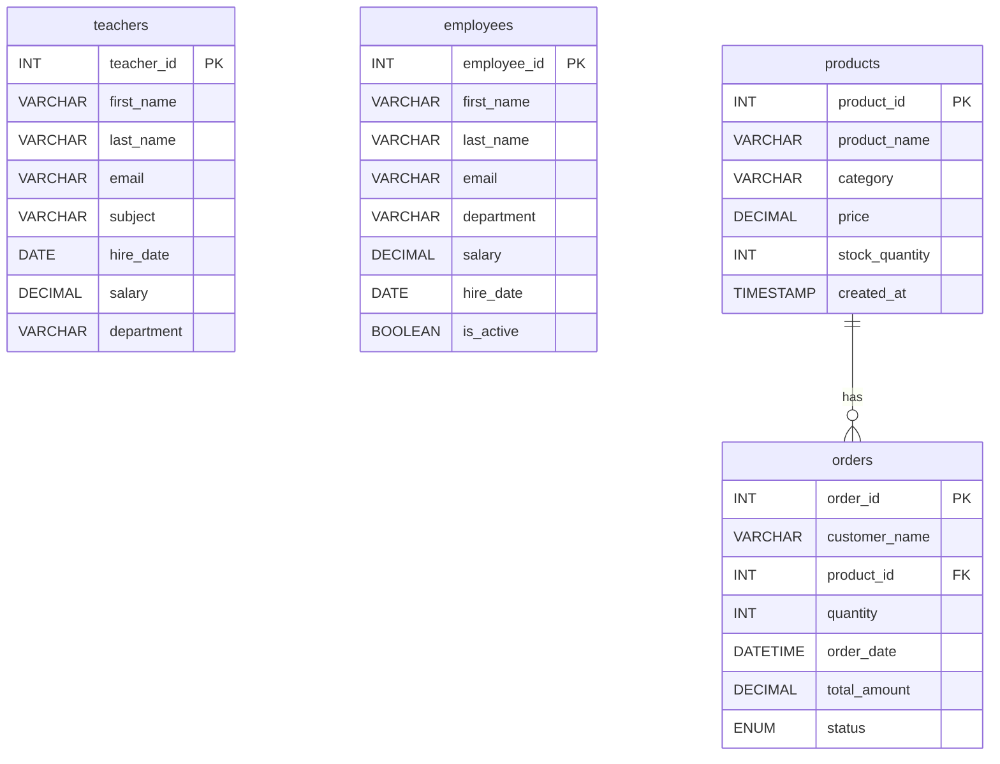

# SQL Mastery

Learn SQL from scratch using a structured, hands-on lesson path, interactive web playground, terminal CLI, multi-dialect support, and real-world analytical case studies.

## Course Contents

| # | Lesson | Topics Covered |
|---|--------|----------------|
| 00 | [Setup Database (MySQL)](00_Setup_Database.sql) | Create clean MySQL schema and seed data |
| 00PG | [Setup Database (PostgreSQL)](00_Setup_Database_PostgreSQL.sql) | PostgreSQL-compatible setup script |
| 00LITE | [Setup Database (SQLite)](00_Setup_Database_SQLite.sql) | Zero-config SQLite setup script |
| 01 | [Introduction to SQL](01_Introduction_to_SQL.sql) | Databases, data types, CREATE TABLE, constraints, ALTER TABLE |
| 02 | [INSERT Data](02_INSERT_Data.sql) | Single/multi-row INSERT, INSERT SELECT, UPSERT patterns |
| 03 | [SELECT Queries](03_SELECT_Queries.sql) | SELECT, filtering, aliases, sorting, limits |
| 04 | [UPDATE & DELETE](04_UPDATE_DELETE.sql) | Data modifications, safe patterns, CASE updates |
| 05 | [WHERE Clause](05_WHERE_Clause.sql) | Filtering logic and condition building |
| 06 | [ORDER BY & LIMIT](06_ORDER_BY_LIMIT.sql) | Sorting and pagination |
| 07 | [Aggregate Functions](07_Aggregate_Functions.sql) | COUNT, SUM, AVG, MIN, MAX |
| 08 | [GROUP BY & HAVING](08_GROUP_BY_HAVING.sql) | Grouping rows and filtering grouped data |
| 09 | [JOINS](09_JOINS.sql) | INNER, LEFT, RIGHT, and join techniques |
| 10 | [Subqueries](10_Subqueries.sql) | Nested queries and correlated subqueries |
| 11 | [Functions](11_Functions.sql) | String, numeric, date, and conditional functions |
| 12 | [CASE Expressions](12_CASE_Expressions.sql) | Conditional output and computed categories |
| 13 | [Views](13_Views.sql) | Reusable query abstractions |
| 14 | [Indexes](14_Indexes.sql) | Indexing basics and performance concepts |
| 15 | [Constraints](15_Constraints.sql) | Data integrity rules and enforcement |
| 16 | [SQL Challenges](16_SQL_Challenges.sql) | Practice tasks for interview-style problem solving |
| 16A | [Challenge Answers](16_SQL_Challenges_Answers.sql) | Reference solutions for challenge tasks |
| 16B | [Extended Challenges](16_SQL_Challenges_Extended.sql) | 50+ problems organized by difficulty & real-world scenarios |
| 17 | [Advanced SQL](17_Advanced_SQL.sql) | CTEs, window functions, and transactions |
| 18 | [Stored Procedures](18_Stored_Procedures.sql) | Reusable parameterized code blocks and control flow |
| 19 | [Triggers](19_Triggers.sql) | Automating actions on INSERT, UPDATE, DELETE |
| 20 | [Query Optimization](20_Query_Optimization.sql) | Using EXPLAIN to understand execution plans |
| 21 | [User Management](21_User_Management.sql) | DCL, GRANT, REVOKE, and user security |
| 22 | [JSON Data](22_JSON_Data.sql) | Storing, querying, and updating JSON documents |
| 23 | [Database Design](23_Database_Design.sql) | Normalization forms (1NF, 2NF, 3NF) |
| 24 | [Concurrency](24_Concurrency.sql) | ACID, Isolation Levels, and Locks |
| 25 | [Full-Text Search](25_Full_Text_Search.sql) | MATCH() AGAINST() and Boolean Text Search |
| 26 | [Import & Export](26_Import_Export.sql) | LOAD DATA INFILE and OUTFILE exports |
| 27 | [Recursive CTEs](27_Recursive_CTEs.sql) | Hierarchical data and WITH RECURSIVE |
| 28 | [Dynamic SQL](28_Dynamic_SQL.sql) | PREPARE and EXECUTE statements |
| 29 | [Advanced Error Handling](29_Advanced_Error_Handling.sql) | DECLARE HANDLER and Cursors |
| 30 | [Data Warehousing (OLAP)](30_Data_Warehousing.sql) | Analytical queries, ROLLUP, and Grouping |
| 31 | [Table Partitioning](31_Table_Partitioning.sql) | RANGE, LIST, HASH partitioning for large tables |
| 32 | [Geospatial Data](32_Geospatial_Data.sql) | Spatial data types and ST_Distance_Sphere |
| 33 | [SaaS Analytics](33_SaaS_Analytics.sql) | Monthly Recurring Revenue (MRR), Churn, Cohorts, ARPU |
| 34 | [E-Commerce Analytics](34_Ecommerce_Funnel_Analytics.sql) | Conversion Funnels, Cart Abandonment, Basket Analysis |
| 35 | [Marketing Attribution](35_Marketing_Attribution.sql) | First-touch, Last-touch, and Linear Attribution Models |
| 36 | [Financial Analytics](36_Financial_Analytics.sql) | Moving averages, MoM Growth, and Running Totals |
| 37 | [Time-Series Analysis](37_Time_Series_Analysis.sql) | Sessionization and handling time gaps |
| 99 | [Final Capstone](99_Final_Capstone.sql) | Comprehensive Data Analyst Assessment |
| 99A | [Capstone Answers](99_Final_Capstone_Answers.sql) | Reference queries for the Capstone |
| 00R | [Reset Database](00_Reset_Database.sql) | Quickly reset environment before rerunning lessons |

## 🌐 Interactive Web SQL Playground

Want to practice SQL directly in your web browser without installing anything? Check out [`web_playground/index.html`](web_playground/index.html)!
- **Zero Configuration**: Runs in-browser via WebAssembly SQLite engine.
- **Interactive Features**: Live query execution, dark theme UI, ERD diagram visualizer, schema browser, and instant challenge evaluator.

## 💻 Interactive Terminal CLI Tool

Practice your queries directly in your terminal using the Python CLI tool in [`cli_tool/`](cli_tool/):
```bash
python cli_tool/interactive_practice.py
```
- Supports zero-config SQLite mode out of the box.
- Supports MySQL connection with `python cli_tool/interactive_practice.py --mysql`.

## 🧪 Automated Challenge Test Runner

Verify your SQL challenge solutions automatically:
```bash
python scripts/validate_challenges.py
```

## 🔀 Multi-Dialect Support & Comparison

Check out the [DIALECT_COMPARISON.md](DIALECT_COMPARISON.md) guide detailing syntax differences across **MySQL**, **PostgreSQL**, and **SQLite**.

## Database Schema

Below is the Entity-Relationship Diagram (ERD) representing the `school_management` practice database:



## Application Integration

Check out the [`app_integration/`](app_integration/) directory for examples demonstrating how to connect to this database and run queries from different programming languages:
- **Node.js**: Connection pooling and preventing SQL injection.
- **Python**: Using `mysql-connector-python` to fetch data.
- **Java**: Standard JDBC implementation.
- **Go (Golang)**: Standard `database/sql` implementation.

## Contributing

Contributions are welcome: more exercises, additional datasets, query optimizations, and clearer explanations.
